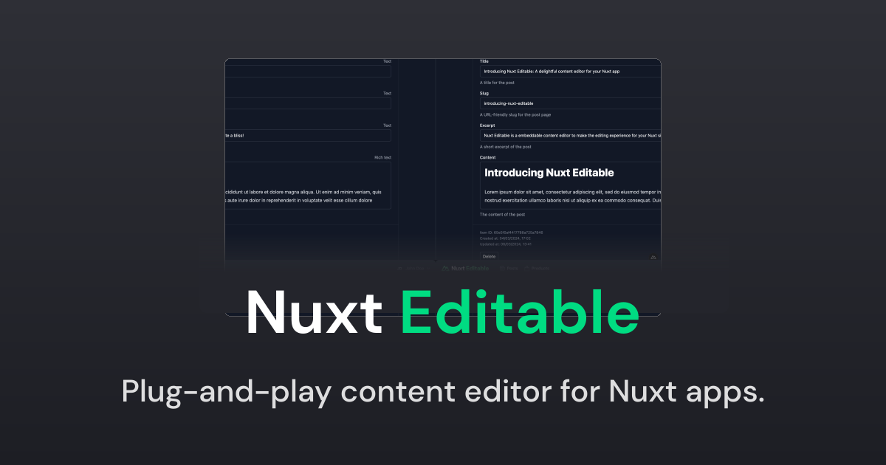

[](https://nuxt-editable.nickvandenberg.dev)

# Nuxt Editable

[![npm version][npm-version-src]][npm-version-href]
[![npm downloads][npm-downloads-src]][npm-downloads-href]
[![License][license-src]][license-href]
[![Nuxt][nuxt-src]][nuxt-href]

Nuxt Editable is a free content editor UI to embed in your Nuxt site. It gives you a great editing experience by allowing you to click to edit content in-place.

- [✨ &nbsp;Release Notes](/CHANGELOG.md)
  <!-- - [🏀 Online playground](https://stackblitz.com/github/nvdb31/nuxt-editable?file=playground%2Fapp.vue) -->
  <!-- - [📖 &nbsp;Documentation](https://example.com) -->

## Features

- Live edit your Nuxt site
- Works with any content by defining your own schemas.
- Bring your own data – integrates with any database or headless CMS.

## Quick Setup

1. Add `nuxt-editable` dependency to your project

```bash
# Using pnpm
pnpm add -D nuxt-editable

# Using yarn
yarn add --dev nuxt-editable

# Using npm
npm install --save-dev nuxt-editable
```

2. Add `nuxt-editable` to the `modules` section of `nuxt.config.ts`

```js
export default defineNuxtConfig({
  modules: ['nuxt-editable'],
});
```

That's it! You can now use Nuxt Editable in your Nuxt app ✨

## Development

```bash
# Install dependencies
npm install

# Generate type stubs
npm run dev:prepare

# Develop with the playground
npm run dev

# Build the playground
npm run dev:build

# Run ESLint
npm run lint

# Run Vitest
npm run test
npm run test:watch

# Release new version
npm run release
```

<!-- Badges -->

[npm-version-src]: https://img.shields.io/npm/v/nuxt-editable/latest.svg?style=flat&colorA=020420&colorB=00DC82
[npm-version-href]: https://npmjs.com/package/nuxt-editable
[npm-downloads-src]: https://img.shields.io/npm/dm/nuxt-editable.svg?style=flat&colorA=020420&colorB=00DC82
[npm-downloads-href]: https://npmjs.com/package/nuxt-editable
[license-src]: https://img.shields.io/npm/l/nuxt-editable.svg?style=flat&colorA=020420&colorB=00DC82
[license-href]: https://npmjs.com/package/nuxt-editable
[nuxt-src]: https://img.shields.io/badge/Nuxt-020420?logo=nuxt.js
[nuxt-href]: https://nuxt.com
