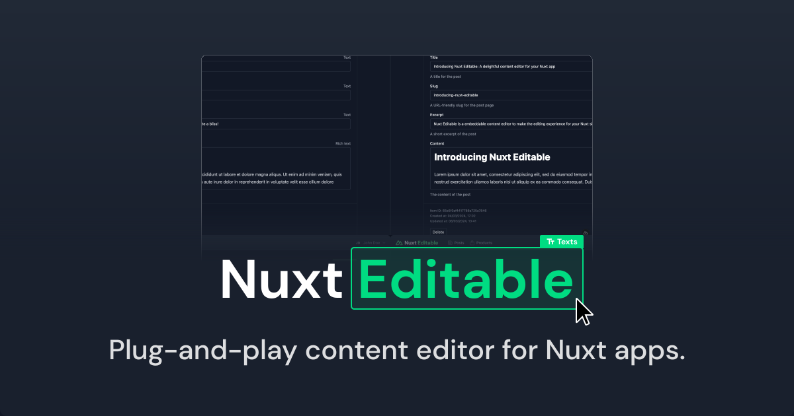

[](https://nuxt-editable.nickvandenberg.dev)

# Nuxt Editable

[![npm version][npm-version-src]][npm-version-href]
[![npm downloads][npm-downloads-src]][npm-downloads-href]
[![License][license-src]][license-href]
[![Nuxt][nuxt-src]][nuxt-href]

Nuxt Editable is a free content editor UI to embed in your Nuxt site. It gives you a great editing experience by allowing you to click to edit content in-place.

- [✨  Release Notes](/CHANGELOG.md)
  <!-- - [🏀 Online playground](https://stackblitz.com/github/nvdb31/nuxt-editable?file=playground%2Fapp.vue) -->
  <!-- - [📖 &nbsp;Documentation](https://example.com) -->

## Features

- Drop-in a component and live edit your Nuxt site.
- Works with _any_ content by defining your own schemas.
- Bring your own data – integrates with any database or headless CMS.

## Examples
Check out these examples to get up and running in no time:

- [Firebase (Coming soon)](#)
- [MongoDB (Coming soon)](#)
- [PostgreSQL (Coming soon)](#)

## Quick Setup

**TL;DR** Add `NuxtEditableEditor` to your `app.vue`. Provide items through the `items` prop. Listen for data changes through `@change`. That's it! ✨

Here's a step-by-step setup:

1. Add `nuxt-editable` dependency to your project

```bash
# Using pnpm
pnpm add -D nuxt-editable

# Using yarn
yarn add --dev nuxt-editable

# Using npm
npm install --save-dev nuxt-editable
```

2. Add `nuxt-editable` to the `modules` section of `nuxt.config.ts`

```js
export default defineNuxtConfig({
  modules: ['nuxt-editable'],
});
```
3. Configure your schemes
In Nuxt Editable works by defining a scheme for your all the data entities you want to edit. Here's an example:

```js
posts: {
      name: {
        singular: 'Post',
        plural: 'Posts'
      },
      icon: 'i-heroicons-newspaper',
      schema: {
        title: {
          type: EditableCollectionSchemaFieldType.Text,
          help: 'A title for the post',
          required: true
        },
        slug: {
          type: EditableCollectionSchemaFieldType.Text,
          help: 'A URL-friendly slug for the post page',
          required: true
        },
        excerpt: {
          type: EditableCollectionSchemaFieldType.Text,
          help: 'A short excerpt of the post'
        },
        content: {
          type: EditableCollectionSchemaFieldType.RichText,
          help: 'The content of the post'
        }
      }
  }
```

4. Add the editor component to your app
You can add the Editor anywhere in your app, but to allow the editor to be rendered regardless of which route you're on, it's probably best to add the editor to your `app.vue`.

```js
<NuxtEditableEditor
  :user="currentEditorUser"
  :data="currentEditorData"
  :pending="isPendingEditorData"
  @change="onEditorChangeData"
  @request-data="onEditorRequestData"
/>
```

Users can bring up the editor by passing `?editable=true` in the route.

6. Provide data to the editor
With your `Posts` collection defined, bringing up the editor will now list a Posts item. When a user clicks on a collection or a collection item, the editor requests data for it. You need to listen to the `requestData` event. Example:

```js
const currentEditorData = ref({
    posts: []
})

const onEditorRequestData = async (event: EditableRequestDataEvent) => {
  isPendingEditorData.value = true
  currentEditorData.value.posts = await $fetch(`/api/posts`)
  isPendingEditorData.value = false
}
```

6. Listen for data updates from the editor
When a user makes a change, e.g. when creating, updating or deleting an item, the editor emits a `change` event. You need to listen for the `change` event and update data accordingly. Example:

```js
const onEditorChangeData = async (event: EditableChangeEvent) => {
  const { type, payload } = event
  isPendingEditorData.value = true

  switch (type) {
    // When creating an item
    case EditableChangeEventType.Create:
      $fetch(`/api/posts`, {
        method: 'POST',
        body: payload.data
      })
      break

    // Other cases for updating and deleting here
  }
  isPendingEditorData.value = false
  refreshNuxtData()
}
```

7. Add a user to the editor
You'll typically want to allow users to log in to the editor. You can provide the currently logged in user through the `user` prop. On the built-version of your Nuxt app, the Editor will default to a login screen if the `user` has not been provided. The editor emits a `login` and `logout` event for you to handle accordingly.

## Development

```bash
# Install dependencies
npm install

# Generate type stubs
npm run dev:prepare

# Develop with the playground
npm run dev

# Build the playground
npm run dev:build

# Run ESLint
npm run lint

# Run Vitest
npm run test
npm run test:watch

# Release new version
npm run release
```

<!-- Badges -->

[npm-version-src]: https://img.shields.io/npm/v/nuxt-editable/latest.svg?style=flat&colorA=020420&colorB=00DC82
[npm-version-href]: https://npmjs.com/package/nuxt-editable
[npm-downloads-src]: https://img.shields.io/npm/dm/nuxt-editable.svg?style=flat&colorA=020420&colorB=00DC82
[npm-downloads-href]: https://npmjs.com/package/nuxt-editable
[license-src]: https://img.shields.io/npm/l/nuxt-editable.svg?style=flat&colorA=020420&colorB=00DC82
[license-href]: https://npmjs.com/package/nuxt-editable
[nuxt-src]: https://img.shields.io/badge/Nuxt-020420?logo=nuxt.js
[nuxt-href]: https://nuxt.com
